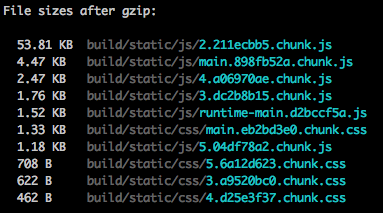

## Characteristics
* Bundle size: [11.8kb](https://bundlephobia.com/result?p=graphql-request@1.8.2)
* Usage: Can use a requester function directly or create a client object and operate with it.
* Documentation: 
* Fragments support: No
* Subscriptions support: No
* Cache: No
* Testing

## Notes
* The result from the server has a **data** root element which this library swallows.
* If there is an error, an error will be thrown with the **errors** root element from the server response.

