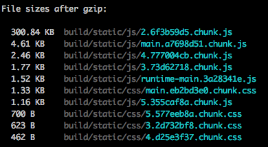

## Characteristics
* Bundle size: [12.0kb](https://bundlephobia.com/result?p=lokka@1.7.0)
** Requires **lokka-trnasport-http** which is [169.4kb](https://bundlephobia.com/result?p=lokka-transport-http@1.6.1). This is because it includes _fetch_ polyfills both for browser and node (should be peer dependencies)
* Usage: Create a client object using a custom Transport (HTTP is the basic)
* Documentation: Basic but complete. I had to dig into Transport code to learn how to disable _includeCredentials_ in fetch requests.
* Fragments support: Yes
* Subscriptions support: No
* Cache: Yes. But it's a special API similar to subscriptions so clients can get updates to a query result.
* Testing

## Notes
* Includes 'credentials' by default in all queries/mutations
* Automatically includes a prefix into mutation definitions so you don't have to. It's mandatory you don't include this or it breaks (https://github.com/kadirahq/lokka#mutations). This should be optional so you don't have to change your mutations if you're migrating. Besides, you can't use named mutations for better debugging in server.

